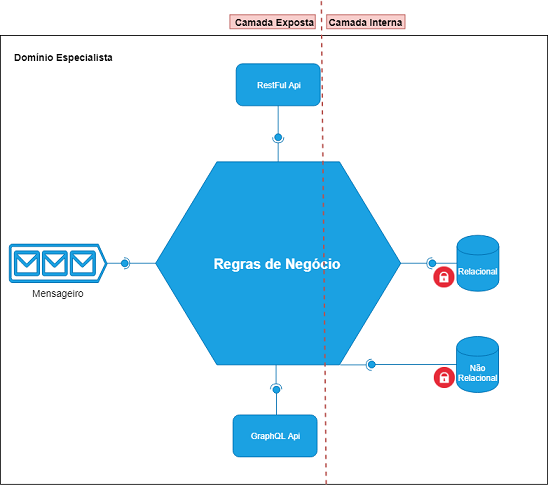
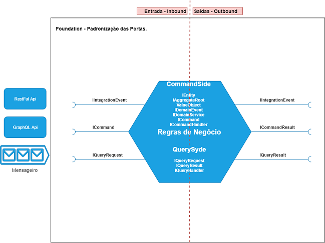

# Tech Challenge Fase 01 - Cadastro de Contatos Regionais

Este projeto faz parte do Tech Challenge da Fase 01, cujo objetivo é desenvolver um aplicativo utilizando a plataforma **.NET 8** para o cadastro de contatos regionais, considerando a persistência de dados, qualidade do código e boas práticas de desenvolvimento.

URL: https://youtu.be/ef8RhF49smw

Equipe:

	Wesley Anderson Leite
	leitewesleyleite@gmail.com

	Lucas Apolinário da Silva
	apolinariodev@gmail.com

	Diego Batista Pereira da Silva
	alpha.diegobatista@gmail.com

	Rafael dos Santos Souza
	rafinha.santos18@hotmail.com

	Cleber Pacheco da Silva Araujo
	cleberpacheco.araujo@gmail.com


## Introdução

O projeto segue uma **Arquitetura Centrada no Domínio** (Domain-Centric Architecture) aplicando o padrão **Hexagonal Architecture** (Ports and Adapters), com foco na separação de responsabilidades e na implementação de componentes desacoplados.



### Aplicação do CQRS

Na parte interna do sistema, está o **Application-Domain**, onde aplicamos o padrão **CQRS** (Command-Query Responsibility Segregation). Isso significa que as operações de comando (modificação de estado) e de consulta (leitura de estado) são separadas em diferentes caminhos, cada um com suas responsabilidades e padrões próprios.

O **Foundation** padroniza as portas (ports da arquitetura hexagonal) conforme o diagrama abaixo:



- **Command-Side**: No lado dos comandos, utilizamos o **Domain-Driven Design (DDD)**, onde as operações são orquestradas por **Comandos** (`ICommand` - `ICommandHandler`).
- **Query-Side**: No lado das consultas, as operações são orquestradas por **Queries** (`IQueryRequest` - `IQueryHandler`).

### Separação de Responsabilidades

No modelo **Foundation**, as camadas de **Command** e **Query** são separadas, não compartilhando modelos nem referências diretas. Isso promove maior desacoplamento e uma divisão clara entre leitura e escrita, melhorando a escalabilidade e a manutenção do sistema ao longo do tempo.

## Requisitos Funcionais

- **Cadastro de Contatos**: O sistema deve permitir o cadastro de novos contatos, incluindo os seguintes campos:
  - Nome
  - Telefone
  - E-mail
  - DDD (Discagem Direta à Distância) correspondente à região do contato.

- **Consulta de Contatos**: Implementar uma funcionalidade que permita consultar e visualizar os contatos cadastrados. A consulta deve poder ser filtrada pelo **DDD** da região.

- **Atualização e Exclusão de Contatos**: O sistema deve permitir a atualização e exclusão de contatos previamente cadastrados.

## Requisitos Técnicos

- **Persistência de Dados**: Os dados dos contatos devem ser armazenados em um banco de dados. As opções de tecnologia para a camada de persistência incluem:
  - **Entity Framework Core** ou
  - **Dapper**

- **Validações**: Implementar validações para garantir que os dados inseridos sejam consistentes e válidos, como por exemplo:
  - Validação de formato de e-mail.
  - Validação de formato de telefone.
  - Validação de campos obrigatórios.

- **Testes Unitários**: O projeto deve incluir testes unitários para validar o comportamento das funcionalidades. As bibliotecas recomendadas são:
  - **xUnit** ou
  - **NUnit**

## Arquitetura

A arquitetura do projeto foi desenvolvida seguindo as boas práticas de **Domain-Driven Design (DDD)** e **CQRS**, utilizando camadas bem definidas para facilitar a manutenção e extensibilidade do sistema.

- **Command-Side**: Focado na modificação de estado, utilizando `ICommand` e `ICommandHandler` para orquestrar as operações de escrita.
- **Query-Side**: Focado em consultas e leitura de estado, utilizando `IQueryRequest` e `IQueryHandler`.

Cada camada tem sua responsabilidade bem definida e não compartilham modelos ou referências diretas entre si.

### Ferramentas Utilizadas

- **.NET 8**: Plataforma utilizada para o desenvolvimento da aplicação.
- **Entity Framework Core**: Utilizado para a persistência dos dados.
- **FluentValidation**: Implementação das validações para garantir a consistência dos dados.
- **xUnit**: Ferramenta utilizada para os testes unitários.

## Executando o Projeto

Para rodar o projeto localmente, siga os passos abaixo:

1. **Clonar o Repositório**:
   ```bash
   git clone <url-do-repositorio>
   cd <nome-do-repositorio>
